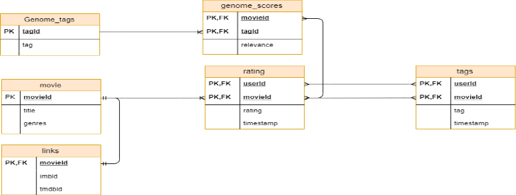
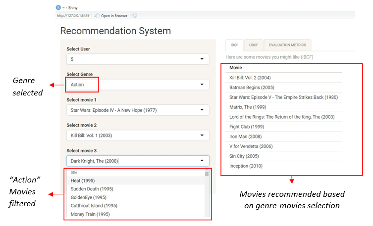
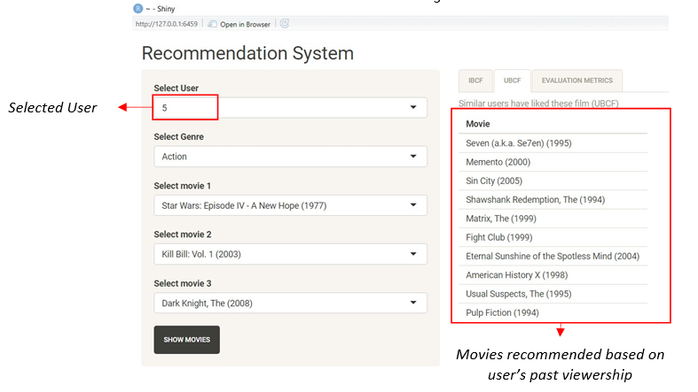

# Recommender System

## Introduction

Project uses sophisticated techniques to build a personalized movie recommendation system based on the user’s
previous movie ratings and similar users’ movie interests. Different people have different tastes in movies, and this is not
reflected in a single score that we see when a movie is looked up on the internet. Our system helps users instantly discover
movies to their liking, regardless of how distinct their tastes may be. Current recommender systems generally fall into two
categories: content-based (item) filtering and user-based collaborative filtering. We experiment with both approaches in
our project.

The objective is to recommend movies to users at two levels: first, based on their past rating history and second,
based on impromptu genre-movie selections. The first prediction model would take into consideration the rating history of
all customers, and having understood the watching patterns of similar users, recommend the user a movie he/she may be
interested in. The second model would take genre as input and 3 movies he/she likes in that genre, thereafter recommend
movies like the movies in the selected genre.

## Dataset

We used the MovieLens movie rating dataset for our project. The data consists of the ~ 27 Million user ratings across
~53.9K movies (20 genres) collected from 1995-2018. It contains 6 CSV files containing attributes about movies, ratings,
tags of user ratings (3 files), and movie links. The entity-relationship diagram is as follows

  
     
    <em>Entity-relationship diagram</em>

## Shiny Dashboard

### Item Based Collaborative filtering

  
     
    <em>Entity-relationship diagram</em>

### User Based Collaborative filtering

  
     
    <em>Entity-relationship diagram</em>

